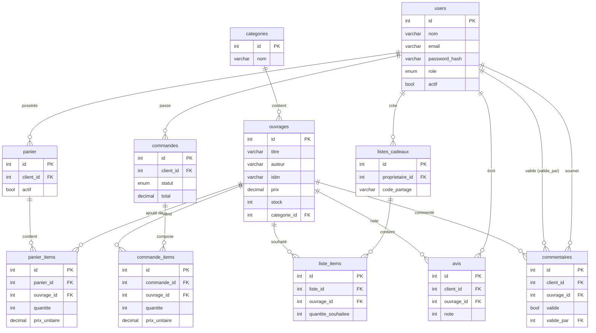

# ERD (Mermaid)

```mermaid
erDiagram
  users ||--o{ panier : "possède"
  users ||--o{ commandes : "passe"
  users ||--o{ listes_cadeaux : "crée"
  users ||--o{ avis : "écrit"
  users ||--o{ commentaires : "soumet"
  users ||--o{ commentaires : "valide (valide_par)"
  categories ||--o{ ouvrages : "contient"
  ouvrages ||--o{ panier_items : "ajouté dans"
  panier ||--o{ panier_items : "contient"
  commandes ||--o{ commande_items : "compose"
  ouvrages ||--o{ commande_items : "vend"
  listes_cadeaux ||--o{ liste_items : "contient"
  ouvrages ||--o{ liste_items : "souhaité"
  ouvrages ||--o{ avis : "note"
  ouvrages ||--o{ commentaires : "commenté"

  users {
    int id PK
    varchar nom
    varchar email
    varchar password_hash
    enum role
    bool actif
  }
  categories {
    int id PK
    varchar nom
  }
  ouvrages {
    int id PK
    varchar titre
    varchar auteur
    varchar isbn
    decimal prix
    int stock
    int categorie_id FK
  }
  panier {
    int id PK
    int client_id FK
    bool actif
  }
  panier_items {
    int id PK
    int panier_id FK
    int ouvrage_id FK
    int quantite
    decimal prix_unitaire
  }
  commandes {
    int id PK
    int client_id FK
    enum statut
    decimal total
  }
  commande_items {
    int id PK
    int commande_id FK
    int ouvrage_id FK
    int quantite
    decimal prix_unitaire
  }
  listes_cadeaux {
    int id PK
    int proprietaire_id FK
    varchar code_partage
  }
  liste_items {
    int id PK
    int liste_id FK
    int ouvrage_id FK
    int quantite_souhaitee
  }
  avis {
    int id PK
    int client_id FK
    int ouvrage_id FK
    int note
  }
  commentaires {
    int id PK
    int client_id FK
    int ouvrage_id FK
    bool valide
    int valide_par FK
  }
```
